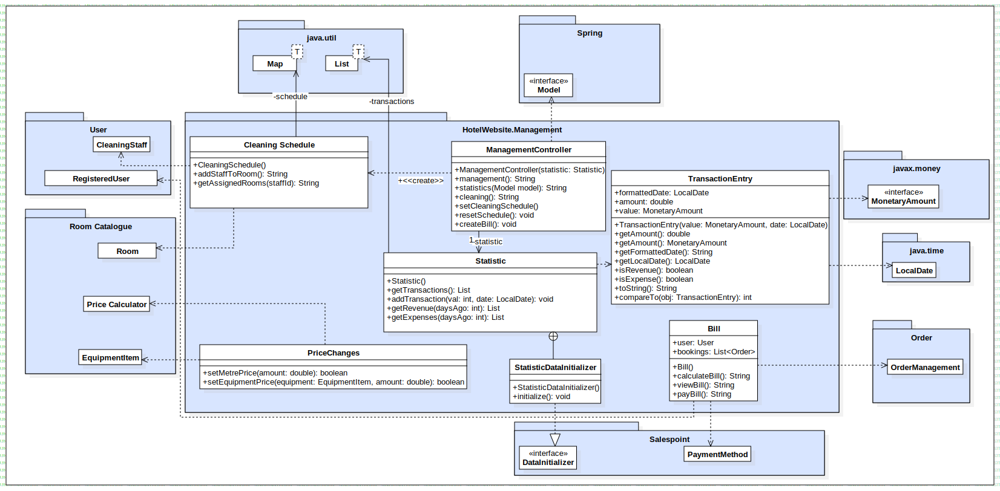

= System Specifications
:doctype: book
:toc: macro
:numbered: 
:company_name: Three Seasons

toc::[] 

[options="header"]
[cols="1, 3, 3"]
|===
|Version | Processing Date   | Author 
|1.1  | 12.11.2023 | Antonia Groß
|1.0	| 11.11.2023 | Celina Stransky
|===

== Introduction and Goals
In the forthcoming sections, we will delve into the details of our task implementation, unraveling the blueprint that guides our program's structure. This developer documentation not only illuminates the specifics of our implementation plan but also delineates the application's architecture.

On one front, you'll discover insights into the end-users of our application and their interaction dynamics. On the flip side, a comprehensive breakdown of our coding structure awaits, giving details on the interplay of packages, the hidden functionalities within our backend, and the nuanced procedures embedded in the codebase.

Commencing with the Task Description, this documentation serves as a compass through the intricate landscape of our software project. It elucidates how users engage with our application and provides a detailed walkthrough of our code's organization. We unravel the intricate tapestry of packages and their mutual dependencies, explaining the backend procedures that might be less perceptible to end-users or appear somewhat abstract when looking through the code.
Lets start off with the Task Description:

For a hotel, which is about to be completed, software is to be developed to support the staff in their daily work. The main focus is on room management and reservation.

In addition, other areas of responsibility have to be covered. The hotel has many single and double rooms. These differ in size, equipment and last but not least in price. Furthermore, the house offers its guests different suites with a different number of rooms. As with the single and double rooms, there are also suites with different sizes and equipment. It should also be noted that both the price and the equipment of the rooms and suites are subject to change at any time. The programm should be flexible enough to allow it to be adapted as easily as possible to new circumstances. 

The room reservation can be made either by telephone or via the internet. The principle of the order process is the same in both cases. After the guest has expressed their wishes (number of rooms, number of beds, equipment, period, etc. ), the program should list all available rooms corresponding to the mentioned criteria. In the event that the desired combination is not available within the specified period, the system should suggest possible alternatives. Several rooms/suites can also be booked in a single order. The price per night depends on the size and equipment of the rooms as well as on the desired food (breakfast, half board or full board). In addition, a surcharge is charged depending on the season.

Reservations can be cancelled at any time, however a fee will be charged. For this purpose, some data of the guests, such as name and Credit card data must be stored. The occupancy or reservation of the individual rooms should be available to the staff at any time. When guests arrive, their personal  data is completed. Guests who do not check-in will be charged the full amount. Upon departure, each guest receives a detailed invoice for the cost of accommodation, meals, consumption of the mini-bar, room service, etc.

The occupied rooms are cleaned daily. At the same time, the consumption of the mini-bar is recorded. Both are the responsibility of the cleaning staff, who have to be reassigned to the corresponding rooms every day. This task is not always trivial, since cleaning depends on
size of the rooms different time-consuming. In addition, a final cleaning of the rooms is necessary on the day of departure, for which additional time has to be scheduled.

Finally, some administrative tasks should be mentioned. For example, every day a list of the income and expenses of the previous day should be available. It should also be possible to look at statistics covering a longer period of time. Furthermore, the manager also needs various statistical evaluations, such as the average occupancy of the rooms. Staff should also be able to use the system to: submit holiday requests, which in turn can be processed by the hotel manager.

In the end, with the software, the users should be able to:

* Login and Logout
* search for rooms in the catalogue
* make a reservation
* cancel a reservation

Additionally the staff and the managers should be able to:

* assign cleaning staff
* put in vacation requests
* look at statistics for the hotel

== Constraints
=== Hardware Specifications
A list of necessary devices / hardware to run and use the application:

* Server
* Computer
* Keyboard
* Mouse

=== Software Specifications
A list of necessary software to run and use the application:

The following (or newer) Java version is necessary to run the application:

* Java 17

The following (or newer) browser versions are necessary to use the application:

* Mozilla Firefox, version 92.0.1+
* Google Chrome, version 94.0.4606+
* Safari, version 14.0+
* Internet Explorer / Edge 10.0+

=== Product Usage
The hotel system is utilized as a website to display available rooms to customers and enable room bookings/cancellation. 

Staff and the hotel manager should also be able to use the website with extended following functions: 

* managing the room cleaning schedule
* keeping track of income and expenditure (just for hotel manager)
* creating (staff) and managing (hotel manager) holiday requests
* entering minibar consumptions in the system
* creating total bills for customers

The software is supposed to run on a server and be available through the internet (via a browser 24/7).

The users of the software are the customers, the staff and the hotel manager, all of whom should be familiar with the typical navigation schemes of a website.

The system shall not need technical maintenance.
The data shall be stored persistently in a database (H2 Database) and be accessible through the application. (the staff and the hotel manager do not need sql knowledge).

== Context and Scope
[[contextdiagram]]

== Solution Strategy

=== Quality Demand Fulfillment

[options="header"]
|=== 
|Quality Demand |Solution approach
|Maintainability a|
* *Modularity* Design the application using distinct components to reduce the impact of changes in one component on others. 
* *Reusability* Develop components that can be reused by other parts of the system.
|Usability a|
* *Learnability* Design the system for easy understanding and use
* The user interface should prioritise user experience, ensuring it is intuitive and easy to navigate.
* *Accessibility* Ensure that people with a wide range of characteristics can fully use the system.  
* *Aesthetic User Interface* Create an appealing and enjoyable user interaction with a focus on design aesthetics.

|Security a|
* *Data Confidentiality Assurance* Implement measures to ensure that data is exclusively accessible to individuals with proper authorisation.
* *Access Controls and Authentication* Implement access controls and authentication mechanisms to thwart unauthorised access attempts and safeguard system integrity.

|===

=== Software Architecture
image::./models/analysis/TopLevelArchitecture.svg[ 100%, 100%, pdfwidth=100, title="Top Level Diagram", align=center]

=== Architecture Decisions

==== Design Patterns

* Spring MVC

==== Persistence

The application uses *Hibernate annotation based mapping* to map Java classes to database tables. As a database, *H2* is used.
The persistence is deactivated by default. To activate persistence storage, the following two lines in the file _application.properties_ have to be uncommented:
....
# spring.datasource.url=jdbc:h2:./db/HotelWebsite
# spring.jpa.hibernate.ddl-auto=update
....

==== User Interface
[[DialogMap]]

==== Use of external frameworks

[options="header", cols="1,2,3"]
|===
|External Package |Used By |Why
|org.springframework.boot a| * Hotelwebsite.RoomCatalog | Configuration for Spring application
|org.springframework.web a|
* Hotelwebsite.RoomCatalog
* Hotelwebsite.Reservation
* Hotelwebsite.User
* Hotelwebsite.Management
| Application interface as static website
|org.springframework.security a|
* Hotelwebsite.User
* Hotelwebsite.RoomCatalog
* Hotelwebsite.Management
* Hotelwebsite.Reservation
| Security features for the hotel application to authorize website  access
|org.springframework.data a|
* Hotelwebsite.RoomCatalog
* Hotelwebsite.User
* Hotelwebsite.Reservation
* Hotelwebsite.Management
| JPA connection utility to database layer
|org.salespointframework a|
* Hotelwebsite.RoomCatalog
* Hotelwebsite.User
* Hotelwebsite.Reservation
* Hotelwebsite.Management
| Usage of SalesPoint POS functionality
|java.time a|
* Hotelwebsite.Reservation
* Hotelwebsite.Management
| Integration of Time tags for Orders and Accountancy
|java.money a|
* Hotelwebsite.Management
| Integration of Currency for Transactions
|java.util a|
* Hotelwebsite.Management
| Usage of Collections for Backend
|===

== Building Block View

=== Catalog
[[Catalog]]

[options="header"]
|=== 
|Class/Enumeration |Description
|Room  |Provides the catalog with objects of the type "Room" and saves features of the room
|Suite |Handles rooms of type "Suite" which have special attributes according to the "Room" class
|EquipmentItem|Represents special equipment in the rooms e.g. TV, Fridge, Balcony, ect.
|PriceCalculator| Calculates the total price of a room per day which regards equipment, bedcount and area of a room
|CatalogController|A Spring MVC Controller to handle the requests of rooms in the catalog and room details site.
|CatalogRepository|A crudRepository to handle requests to the Database
|CatalogDataInitializer|An implementation of the DataInitialzier to create some example data for the catalog
|===

=== Reservation/Order
[[Reservation]]

[options="header"]
|=== 
|Class/Enumeration |Description
|OrderController |A Spring MVC Controller to handle requests to the cart site and the bookings site.
|===

=== User
[[User]]

[options="header"]
|=== 
|Class/Enumeration |Description
|RegisteredUserRepository |A repository interface to manage User-instances.
|RegisteredUser |Custom class to extend the Salespoint-UserAccount with an creditcardnumber.
|RegisteredUserController |A Spring MVC Controller that handles all the routes required for the Login and Registration process of the website. 
|RegisteredUserInitializer |Initializes a few Test users, the core staff like the manager and some base employees using the Datainitializer.
|RegisteredUserManagement |The Class that manages the User Database and has the logic for creating the different users. 
|Registrationform |An interface to validate the user input of the registration formular.
|===

=== Management
[[Management]]

[options="header"]
|=== 
|Class/Enumeration |Description
|ManagementController |A Spring MVC Controller to handle requests to the statistics site, the cleaning site and the Price Changes site
|CleaningSchdule | Allows Manager to assign Staff to cleaning for certain rooms
|PriceChanges | Allows Manager to adjust HotelRoom Price and EquipmentItem Price
|Statistic | Contains all the TransactionEntries 
|StatisticDataInitialzer | An implementation of the DataInitialzier to create dummy TransactionEntries for the statistic
|TransactionEntry | Contain the amount and the date of a transaction (Expenses and Revenues)
|===

=== Traceability between Analysis- and Design Model
_The following table shows the Forward- and Backward Traceability from the Analysis Model to the Design Model and vice versa._

[options="header"]
|===
|Klasse/Enumeration (Analysemodell) |Klasse/Enumeration (Entwurfsmodell)
|Hotelwebsite a|
* Hotelwebsite.RoomCatalog
|User a|
* salespointframework.UserAccount
* salespointframework.Role
|Registered User a|
* salespointframework.UserAccount
* salespointframework.Role
|Guest a|
* salespointframework.UserAccount
* salespointframework.Role
|Manager a|
* salespointframework.UserAccount
* salespointframework.Role
|Staff a|
* salespointframework.UserAccount
* salespointframework.Role
|FreeRoomCatalog a|
* Hotelwebsite.RoomCatalog
|Suite a|
* Hotelwebiste.RoomCatalog.Suite
|Room a|
* Hotelwebsite.RoomCatalog.Room
* salespointframework.Product
|Single Room a|
* Hotelwebsite.RoomCatalog.Room
* salespointframework.Product
|Double Room a|
* Hotelwebsite.RoomCatalog.Room
* salespointframework.Product
|equipmentItem a|
* Hotelwebsite.RoomCatalog.EquipmentItem
|PendingReservation a|
* salespointframework.OrderStatus
|Reservation a|
* salespointframework.OrderManagement
|ReservationStatus a|
* salespointframework.OrderStatus
|PaymentStatus a|
* salespointframework.OrderStatus
* salespointframework.Payment
|Bill a|
* Hotelwebsite.Management.Bill
|Cart a|
* salespointframework.Cart
|ReservationCatalog a|
* salespointframework.Order
|VacationRequest a|
* optional/not modeled
|VacReqStatus a|
* optional/ not modeled
|Consumable a|
* optional/not modeled
|===

== Runtimeview

