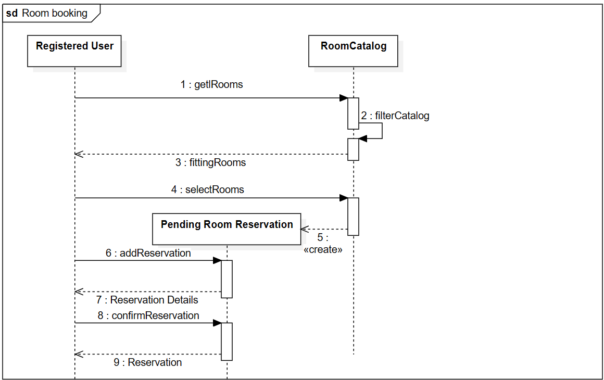
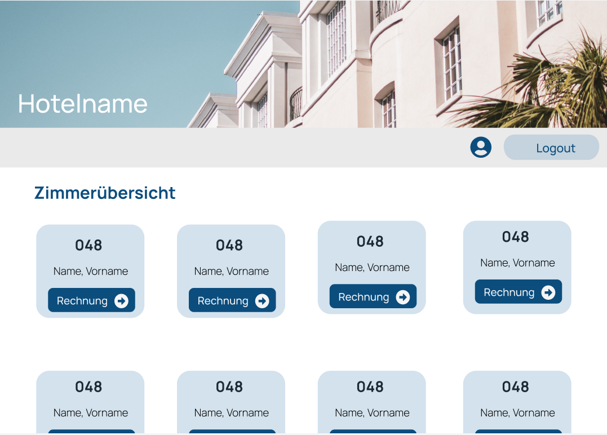

= System Specifications
:doctype: article
:toc: macro
:numbered: 
:company_name: Three Seasons

toc::[] 

== Hotel

[options="header"]
[cols="1, 1, 1, 1, 4"]
|===
|Version | Status      | Bearbeitungsdatum   | Autoren(en) |  Vermerk
|1.0     | In Arbeit   | 29.10.2023          | Antonia Groß, Celina Stransky, Bastian Schunk, Kevin Kamprath, Florian Schmidt, Aituar Tuleu, Adrian Feller, Oliver Pohl    | vorläufige Version 
|===

== Summary
This chapter outlines our project, which involves creating a website for a hotel. The hotel's website will serve three distinct user groups: the manager, the staff, and the customers. Each group will have specific permissions and access levels, as elaborated in subsequent sections.

The primary function of the website is to facilitate room and suite bookings, with various inventory options and features designed to cater to any number of guests. Furthermore, the website will enable staff members to make reservations on behalf of customers who contact the hotel, as well as manage bookings, including cancellations.

In addition, the manager will have a suite of tools at their disposal. They can oversee the hotel's cleaning staff through a cleaning planner and manage employee vacation schedules. Moreover, they will be able to track the hotel's revenue on a daily, weekly, and monthly basis, and adjust room furniture and inventory accordingly. This feature allows the manager to optimize the hotel's offerings in response to demand fluctuations.

== Task

For a hotel, which is about to be completed, software is to be developed to support the staff in their daily work. The main focus is on room management and reservation.

In addition, other areas of responsibility have to be covered. The hotel has many single and double rooms. These differ in size, equipment and last but not least in price. Furthermore, the house offers its guests different suites with a different number of rooms. As with the single and double rooms, there are also suites with different sizes and equipment. It should also be noted that both the price and the equipment of the rooms and suites are subject to change at any time. The programm should be flexible enough to allow it to be adapted as easily as possible to new circumstances. 

The room reservation can be made either by telephone or via the internet. The principle of the order process is the same in both cases. After the guest has expressed their wishes (number of rooms, number of beds, equipment, period, etc. ), the program should list all available rooms corresponding to the mentioned criteria. In the event that the desired combination is not available within the specified period, the system should suggest possible alternatives. Several rooms/suites can also be booked in a single order. The price per night depends on the size and equipment of the rooms as well as on the desired food (breakfast, half board or full board). In addition, a surcharge is charged depending on the season.

Reservations can be cancelled at any time, however a fee will be charged. For this purpose, some data of the guests, such as name and Credit card data must be stored. The occupancy or reservation of the individual rooms should be available to the staff at any time. When guests arrive, their personal  data is completed. Guests who do not check-in will be charged the full amount. Upon departure, each guest receives a detailed invoice for the cost of accommodation, meals, consumption of the mini-bar, room service, etc.

The occupied rooms are cleaned daily. At the same time, the consumption of the mini-bar is recorded. Both are the responsibility of the cleaning staff, who have to be reassigned to the corresponding rooms every day. This task is not always trivial, since cleaning depends on
size of the rooms different time-consuming. In addition, a final cleaning of the rooms is necessary on the day of departure, for which additional time has to be scheduled.

Finally, some administrative tasks should be mentioned. For example, every day a list of the income and expenses of the previous day should be available. It should also be possible to look at statistics covering a longer period of time. Furthermore, the manager also needs various statistical evaluations, such as the average occupancy of the rooms. Staff should also be able to use the system to: submit holiday requests, which in turn can be processed by the hotel manager.

In the end, with the software, the users should be able to:

* Login and Logout
* search for rooms in the catalogue
* make a reservation
* cancel a reservation

Additionally the staff and the managers should be able to:

* assign cleaning staff
* put in vacation requests
* look at statistics for the hotel

== Productusage

The system is going to be used as a Hotel Website by the company {company_name} to allow the customers to view rooms of the hotel and make bookings.
The software is supposed to run on a server and be available through the internet (via a browser) to interested customers, staff and hotel managers 24/7.

The system shall be accessible and visually optimized for the following browsers:

- Mozilla Firefox, version 92.0.1+
- Google Chrome, version 94.0.4606+
- Safari, version 14.0+

The primary users of the software are adult people (customers, staff and hotel manager), who supposedly know typical website navigation schemas,
who all do not necessarily have a technical background.

The system shall not need technical maintenance. The software should be expandable and dynamic in order to support the employees in the best possible way.
Any data shall be stored persistently in a database and be accessible through the application (e.g. no SQL knowledge should be required for the staff and hotel manager).

== Stakeholders

[options="header", cols="2, ^1, 4, 4"]
|===
|Name
|Priority (1..5)
|Description
|Goals

|Product Owner 
|5
|The owner of the future product/application.
a|
Stable application
Visually appealing application
High occupancy rate
high data security
|Guests & Customers
|4
|Primary user of the application
a|
Good usability
Visually pleasing and clear
Quick and responsive application
|Developers
|3
|People who implement and are responsible for maintaining the application
a|
Easily extendable application
Low maintenance effort
Good debugging mechanisms
|Staff & Management
|3
|Secondary Users, which are working for the Hotel in various positions
a|
Ease of use
Supportive functions 
Simplicity
Better management
|=== 

== Systemborders and Top-Level Architecture

=== Context Diagram
This Diagram shows the System as a whole, and also depicts the People in contact with the System

=== Top-Level-Architecture

== Use-Cases

=== Parties 

// See http://asciidoctor.org/docs/user-manual/#tables
[options="header"]
[cols="1,4"]
|===
|Name | Description
|Manager | Represents any registered User that has the Role "MANAGER". Is responsible for
the administration and management of the hotel and the application. Can manage the inventory
rooms and the employees.
|Staff  |Represents any registered User that has the Role "STAFF". Is responsible for either cleaning
the rooms and checking the minibar consumption or for the booking/canceling of reservations.
|Unregistered User | Represents any unregistered User of the Website. Has only access to the Room Catalog.
|Registered User | Represents any registered User of the Website that has a Account.
Is capabable of booking Rooms and looking at their reservations.
| Guest | Represents any registered User that has an ongoing reservation and is capable of ordering
extras to their room
|===

=== Overview Use-Case Diagram

=== Use-Cases

[[UC0010]]
[cols="1h, 3"]
|===
|ID                         |**<<UC0010>>**
|Name                       |**Register**
|Description                |An unregistered user has the option of creating a personal account.

|Actors                     |Unregistered User
|Trigger                    |An unregistered user wants to create a personal account.
|Precondition(s)           a|The actor does not yet have an account.
|Essential Steps           a|1. Unregistered user presses "registrieren"
                             2. Unregistered user enters username, password and password again
                             3. System checks whether username is already assigned => if not: account with specified data is created if it does: error message appears
|Extensions                 |None
|Functional Requirements    |<<FR-002>>
|===

[[UC0020]]
[cols="1h, 3"]
|===
|ID                         |**<<UC0020>>**
|Name                       |**Login - Logout**
|Description                |A registered user has to have the possibility to login to the system in order to use further functionalities. The reverse of this is the logout.

|Actors                     |Registered User
|Trigger                    |
_Login_: A registered user wants to get access to further functionalities and presses "Login"

_Logout_: A registered user wants to leave the hotel page and presses "Logout"
|Precondition(s)           a|
_Login_: Registered User is not logged in yet

_Logout_: Registered user is logged in
|Essential Steps           a|
_Login_:

  1. Registered user presses "Login"
  2. Registered user enters his username and password
  3. Registered user presses the "anmelden" button

_Logout_:

  4. Registered user presses "Logout"
  5. Registered user is not logged in and is shown the start page
|Extensions                 |None
|Functional Requirements    |<<FR-001>>
|===

[[UC0100]]
[cols="1h, 3"]
|===
|ID                         |**<<UC0100>>**
|Name                       |**View Catalog**
|Description                |Every visitor of the HotelWebsite (i.e. *User*) shall be able to access the Catalog, which displays all the offered hotel rooms.

|Actors                     |Registered User, Unregistered User
|Trigger                    |User wants to view all rooms of the Catalog.
|Precondition(s)           a|None
|Essential Steps           a|1. User sets no filters and clicks on the button to view the available rooms.
                             2. User is shown all rooms of the Catalog.
|Extensions                 |None
|Functional Requirements    |<<FR-003>>, <<FR-005>>
|===

[[UC0110]]
[cols="1h, 3"]
|===
|ID                         |**<<UC0110>>**
|Name                       |Filter Catalog
|Description                |A user  shall be able to filter the Catalog by specific parameters (roomCount, bedCount, desiredInventory, desiredTime).
|Actors                     |registered User, unregistered User
|Trigger                    |User wants to filter rooms of the Catalog by specific parameters.
|Precondition(s)           a|None
|Essential Steps           a|
1. User sets desired filters (roomCount, bedCount, desiredInventory, desiredTime) by input fields and presses on a displayed button to filter the catalog.
2. User is shown the results of the available rooms regarding the set filters. In case no results can be found for the requested period, room alternatives should be offered.
|Extensions                 |-
|Functional Requirements    | <<FR-003>>, <<FR-005>>
|===

[[UC0120]]
[cols="1h, 3"]
|===
|ID                         |**<<UC0120>>**
|Name                       |View RoomDetails
|Description                |User shall be able to view the details of a selected room from the Catalog on an extra page.
|Actors                     |registered User, unregistered User
|Trigger                    |User wants to view the details of a specific room.
|Precondition(s)           a|User is viewing the (filtered) catalog.
|Essential Steps           a|
1.  User presses on a displayed entry (room) of the catalog.
2.  User is shown the details of the selected room.
|Extensions                 |-
|Functional Requirements    | <<FR-003>>, <<FR-005>>
|===

[cols="1h, 3"]
[[UC0400]]
|===
|ID                         | <<UC0400>>
|Name                       |View Statistics
|Description                |The Manager should be able to look at Statistics regarding income and expenses as well as the average occupancy rate
|Actors                     |Manager
|Trigger                    |User press “Statistiken” in the navigation bar
|Precondition(s)           a|Actor is logged in as “Manager”
|Essential Steps           a|
1.  Actor press “Statistiken” in navigation bar
2.  Actor can toggle between periods (Daily, Weekly, ect.)
3.  Actor can see the statistics of the hotel
|Extensions                 |-
|Functional Requirements    | <<FR-010>>
|===

[cols="1h, 3"]
[[UC0420]]
|===
|ID                         | <<UC0420>>
|Name                       |Change Cleaning Plan
|Description                |The Manager should be able to assign cleaning personnel to specific rooms
|Actors                     |Manager
|Trigger                    |Actor presses “Zimmerreinigung” in navigation bar
|Precondition(s)           a|Actor is logged in as “Manager”
|Essential Steps           a|
1. Actor presses “Zimmerreinigung” in navigation bar
2. Actor can see all rooms of the hotel
3. For every room the actor can assign staff via a dropdown Menu
|Extensions                 | -
|Functional Requirements    | <<FR-011>>
|===

[cols="1h, 3"]
[[UC0410]]
|===
|ID                         | <<UC0410>>
|Name                       |Manage VacationRequest
|Description                |Manager should be able to approve, deny or edit vacation requests from the Staff
|Actors                     |Manager
|Trigger                    |Actor presses “Urlaubsanträge” in navigation bar
|Precondition(s)           a|Actor is logged in as “Manager”
|Essential Steps           a|
1. Actor presses “Urlaubsanträge” in navigation bar
2. Actor can see all vacations requests of the Staff
3. Actor can accept, deny or edit all vacation requests listed
|Extensions                 |
|Functional Requirements    | <<FR-012>>
|===

[[UC0430]]
[cols="1h, 3"]
|===
|ID                         |**<<UC0430>>**
|Name                       |Enter MinibarConsumption
|Description                |The staff should be able to enter the consumption of the minibar for a specific room in the system.
|Actors                     |Staff
|Trigger                    |Staff wants to enter a minibar consumption.
|Precondition(s)           a|User is registered as staff.
|Essential Steps           a|
1.  Staff clicks on the button to reach the page for entering a minibar consumption.
2.  Staff enters the noted consumption of the minibar for a specific room by using the input fields and pressing the confirm button.
|Extensions                 |-
|Functional Requirements    | <<FR-008>>
|===

[[UC0440]]
[cols="1h, 3"]
|===
|ID                         |**<<UC0440>>**
|Name                       |View CleaningPlan
|Description                |The Staff shall be able to view a CleaningPlan for the rooms.
|Actors                     |Staff
|Trigger                    |Staff wants to view the current CleaningPlan.
|Precondition(s)           a|User is registered as staff.
|Essential Steps           a|
1.  Staff clicks on the button to reach the page for viewing the CleaningPlan.
2.  Overview of the rooms to be cleaned including the assignment of the cleaning staff appears.
|Extensions                 |-
|Functional Requirements    | <<FR-011>>
|===

[[UC0450]]
[cols="1h, 3"]
|===
|ID                         |**<<UC0450>>**
|Name                       |Create Bill
|Description                |The staff creates a detailed bill for the costs of accommodation, meals, consumption of the mini-bar, room service, etc. which each guest receives on departure.
|Actors                     |Staff
|Trigger                    |Staff wants to create a new bill.
|Precondition(s)           a|User is registered as staff and is viewing the reservation page.
|Essential Steps           a|
1.  Staff clicks on the button to create a new bill for a specific reservation
2.  Staff clicks on the button to confirm the bill creation.
|Extensions                 |-
|Functional Requirements    | <<FR-009>>
|===

[[UC0460]]
[cols="1h, 3"]
|===
|ID                         |**<<UC0460>>**
|Name                       |View VacationRequest
|Description                |The Staff shall be able to view his VactionsRequest(s).
|Actors                     |Staff
|Trigger                    |Staff wants to view the current VacationRequest(s).
|Precondition(s)           a|User is registered as staff.
|Essential Steps           a|
1.  Staff clicks on the button to reach the page for viewing the VacationRequest(s).
2.  New Page shows an Overview of the staff's VacationRequest(s) including the current status is displayed.
|Extensions                 |-
|Functional Requirements    | <<FR-012>>
|===

[[UC0470]]
[cols="1h, 3"]
|===
|ID                         |**<<UC0470>>**
|Name                       |Add VacationRequest
|Description                |Staff has the ability to request vacation through the system.
|Actors                     |Staff
|Trigger                    |Staff wants to apply a vacation request.
|Precondition(s)           a|User is registered as staff.
|Essential Steps           a|
1.  Staff clicks on the button to reach the page (main page) for viewing the VacationRequest(s).
2.  Staff selects period of vacation via the shown input field.
3.  Staff clicks on the button to submit VacationRequest.
|Extensions                 |-
|Functional Requirements    | <<FR-012>>
|===

[cols="1h, 3"]
[[UC0200]]
|===
|ID                         | <<UC0200>>
|Name                       |Add Reservation
|Description                |Users should be able to add a reservation depending on desired room and bed counts, 
what furnishing said rooms should have and in what timeframe the reservations should take place.
|Actors                     |registered User
|Trigger                    |User wants to book a room
|Precondition(s)           a|
- User is registered
- Available rooms are existing
|Essential Steps           a|
1. User chooses Room(s)
2. User chooses timeframe
3. User presses on button “verbindlich reservieren”
|Extensions                 |[UC0220]
|Functional Requirements    |<<FR-003>>, <<FR-005>>, <<FR-006>>
|===

[cols="1h, 3"]
[[UC0210]]
|===
|ID                         | <<UC0210>>
|Name                       | View Reservations 
|Description                | User should be able to see their reservation(s)
|Actors                     | registered User
|Trigger                    | Actor presses “meine Buchungen” in navigation bar
|Precondition(s)           a|
- User is registered
- Actor has reservations
|Essential Steps           a|
1. Actor presses “meine Buchungen” in navigation bar
2. Actor can see their reservations and can edit them (e.g. cancel)
|Extensions                 | <<UC0230>>
|Functional Requirements    | <<FR-003>>
|===

[cols="1h, 3"]
[[UC0220]]
|===
|ID                         |<<UC0220>>
|Name                       | confirm Reservation
|Description                | User should be able to confirm their pending reservation
|Actors                     | registered User 
|Trigger                    | Actor presses “Verbindlich reservieren”
|Precondition(s)           a| 
- User is registered 
- has pending Reservations 
|Essential Steps           a|
1. Actor sees all pending reservations
2. Actor confirms pending reservations via button “Verbindlich reservieren”
|Extensions                 |
|Functional Requirements    |<<FR-005>>
|===

[cols="1h, 3"]
[[UC0230]]
|===
|ID                         |<<UC0230>>
|Name                       | cancel Reservation
|Description                | User should be able to cancel any existing reservations 
|Actors                     | registered User
|Trigger                    | User wants to cancel a reservation
|Precondition(s)           a|
- User is registered
- User has confirmed reservation 
- User is not a Guest
|Essential Steps           a|
1. Actor is in “meine Buchungen”
2. Actor edit a reservation via a button
3. Actor presses “Stornieren”
4. Actor confirms the process
|Extensions                 |
|Functional Requirements    |<<FR-007>>
|=== 

[cols="1h, 3"]
[[UC0300]]
|===
|ID                         | <<UC0300>>
|Name                       | View Products 
|Description                | Guest should be able to look at all Products that can be ordered
|Actors                     | Guest
|Trigger                    | Guest wants to order something to his room by clicking “Zimmerservice” button on room terminal
|Precondition(s)           a| User is a Guest
|Essential Steps           a|
1. Actor enters Terminal in his Hotel Room
1. Actors gets listing of all Products available
|Extensions                 | <<UC0310>>
|Functional Requirements    |<<FR-004>>
|===

[cols="1h, 3"]
[[UC0310]]
|===
|ID                         | <<UC0310>>
|Name                       |  Place Order
|Description                | Guest should be able to order any Product listed in the Terminal to his room.
|Actors                     |  Guest
|Trigger                    | Guest presses "Zimmerservice” Button on room terminal
|Precondition(s)           a| User is Guest
|Essential Steps           a|
1. Actor adds desired products to cart
2. Actor orders products in cart by clicking “Zahlungspflichtig Bestellen”
|Extensions                 | - 
|Functional Requirements    | <<FR-004>>
|===

== Functional Requirements

|===
| ID | Name | Description
[[FR-001]]
| <<FR-001>> | Authentication | The system includes components that are accessible to the public as well as components that require user authentication.
[[FR-002]]
| <<FR-002>> | Registration | The system allows users to register using a password and email.
[[FR-003]]
| <<FR-003>> | Room | Each room has attributes such as area, inventory, and price. Rooms can be Single Rooms, Double Rooms, or Suites, which specify room count. The price and inventory of rooms and suites can be changed.
[[FR-004]]
| <<FR-004>> | Room Services, Ordering | Guests can order food, drinks, video games, movies, and more for their room through the "Hotel Management" website.
[[FR-005]]
| <<FR-005>> | Booking by Guest | Guests can book by specifying the desired room count, bed count, inventory, and timeframe. Room Manager shall check for available rooms matching the criteria and suggest suitable rooms. Guests can reserve several rooms within a single booking. During booking, guests must provide their name and credit card information.
[[FR-006]]
| <<FR-006>> | Pricing Calculation | Room pricing depends on room attributes and the desired meal plan: Breakfast, half-board, full-board with seasonal surcharges.
[[FR-007]]
| <<FR-007>> | Cancellation of Reservations | Reservations can be canceled, but it applies a cancellation fee.
[[FR-008]]
| <<FR-008>> | Minibar | The hotel staff can track minibar inventory and refill it as needed. Charges will be added to the final bill.
[[FR-009]]
| <<FR-009>> | Billing | At the checkout, guests receive a detailed bill that includes overnight costs, meals, minibar usage, and other services.
[[FR-010]]
| <<FR-010>> | Manager's Observations | Hotel managers have access to statistics about income, expenses, and room occupancy.
[[FR-011]]
| <<FR-011>> | Cleaning | The manager assigns two cleaning staff members daily to all occupied rooms.
[[FR-012]]
| <<FR-012>> | Vacation Requests | Staff can request vacations through the system. The hotel manager can approve, deny, or edit them. The status of the vacation requests can be viewed by staff (Pending, Declined, Approved, or Edited).
[[FR-013]]
| <<FR-013>> | Payment | The system should provide a guest the ability to make  payments for their reservations and services.
|===

== Non-Functional Requirements

|===
| Quality Demands | Priority | Description

| Usability | High | The interface should be straightforward for users to navigate.

| Security | Medium | User data must be securely stored and transmitted.

| Maintainability | Medium | Code must adhere to coding standards.
|===

== GUI Prototype

=== Overview: Dialogue Map
[[dialoge_map]]

=== Dialogues
==== Booking
A user may input their desired stay (arrival, departure, type of room, amenities) on the landing page and search for available rooms. They may choose multiple rooms.
//To fulfill their reservation, they have to be a registered user and log in.
[[home_image]]

[[available_rooms]]

[[reservation]]

==== Registering
A user may register an account with name and password. They may log in via the header button on every page and be redirected to their account overview.
[[register]]

[[login]]

[[account_overview]]

==== Cancel Reservation
Users may cancel a future reservation by choosing the respective booking in their booking overview and clicking the delete button.
[[cancel]]

==== Manager activities
A manager has access to statistics, general bookings, cleaning schedules and vacation requests. They may get to each functionality by clicking the respective button in their account overview.

In the statistics overview, they may choose between the statistics for the day/week/month by pushing the respective button.

In the overall booking site, they may push the respective button to generate the bill.

[[manager]]

[[statistics]]

[[general_bookings]]

[[bill]]

[[cleaning_schedule]]

[[managing_vacation_requests]]

==== Vacation Requests
Staff may send in vacation requests to be either accepted or denied by the manager. They may view an overview of their vacation requests as well as their status.
[[staff]]

[[staff_vacation_requests]]

== Data model 

=== Overview: Class Diagram
[[classdiagram]]

=== Classes and Enumerations
This paragraph shall describe all classes and enumerations needed by our software

// See http://asciidoctor.org/docs/user-manual/#tables
[options="header"]
[[classes_enumerations]]
|===
|Class/Enumeration  |Description
|Hotelwebsite       |central class of the software representing the Hotel with its Rooms itself
|User               |General representation of a real person.
|Registered User    |General representation of a real person, which has a representation in the system. This representation is only created if a user registers with the system, and only used if he or she authenticates.
|Guest      |A registered user that is currently staying in the hotel.
|Manager    |A user that is registered as an administrator/boss of the videoshop.
|Staff      |A user that is registered and can access the Reservation Catalogue
|FreeRoomCatalog    |Contains all rooms that are available in the specified time
|Suite      |Consists of Several Rooms, and has a certain equipment
|Room       |Generic Room, that can have any reasonable amount of beds
|Single Room |Room, that has only one bed
|Double Room |Room, that has exactly two beds
|equipmentItem |Might be TV, Kitchenette, bathtub etc.
|PendingReservation |Representation of a Room or Suite in the Cart, without blocking the reservation for other users. Is created, when a registered user adds a room to their cart
|Reservation |Created by Cart, the moment user confirms PendingReservation
|Consumable |Can be added to a Reservation while the ReservationStatus is _ACTIVE_ e.g. movies, food etc.
|ReservationStatus | Represents current step of the Reservation. +
_OPEN_: Reservation is valid, Guest has not yet arrived +
_ACTIVE_: Guest has arrived +
_PASSED_: Stay has passed +
_CANCELLED_: Registered User has cancelled this reservation
|PaymentStatus |Whether a reservation has already been paid in advance, or been paid after the stay +
_PAID_ : Reservation has been paid +
_UNPAID__ : Reservation is yet to be paid
|Bill | is created once the ReservationStatus is set to _PASSED_ or _CANCELLED_ or the PaimentStatus is set to _PAID_
|Cart   |Temporary storage for PendingReservations a registered User intends to confirm. If a registered User decides to confirm his PendingReservations, a Reservation is created.
|ReservationCatalog |Overview of all Reservations e.g to edit them
|VacationRequest| Created by Staff, processed/decided by Manager
|VacReqStatus   | Represents current Status of a vacation request +
_APPROVED_ : request was approved by manager +
_DENIED_ : request was denied by manager + 
_PENDING_ : no decision by manger yet
|===

== Acceptance Tests

[cols="1h, 3"]
[[UAT0201]]
|===
|ID                         | <<UAT0201>>
|Use Case                   | <<UC0200>>
|Preconditions              | An unregistered user is using the system
|Event                      | Unregistered user tries to book a room
|Expected                   | User is able to see roomcatalog but can not book a room and are routed to a registration site to register himself in the system
|===

[cols="1h, 3"]
[[UAT0021]]
|===
|ID                         | <<UAT0021>>
|Use Case                   | <<UC0020>>
| Preconditions | System has existing user(s) 
| Event | Unauthorized user tries to login (tester, 123) 
| Expected | User is logged in as “tester” 
|===

[cols="1h, 3"]
[[UAT0202]]
|===
|ID                         | <<UAT0202>>
|Use Case                   | <<UC0200>>
| Preconditons | System has existing user(s) 
| Event | Authorized user tries to book a room 
| Expected | User is able to book a room. The user has to enter his full name and credit card number 
|===

[cols="1h, 3"]
[[UAT0451]]
|===
|ID                         | <<UAT0451>>
|Use Case                   | <<UC0450>>, <<UC0200>>
| Preconditions | System has existing “Staff” user(s) 
| Event | Staff enters “staff only” area 
| Expected | Staff can see more details than users or guests, they can book a room for a user or guest. Staff is not able to see the management area. 
|=== 

[cols="1h, 3"]
[[UAT0311]]
|===
|ID                         | <<UAT0311>>
|Use Case                   | <<UC0310>>
| Preconditions | System has existing guest(s) 
| Event | Guest user orders snacks or movies with the terminal in his room 
| Expected | Staff gets the order and the bill of the snacks and movies is added to the global bill of the room
|=== 

[cols="1h, 3"]
[[UAT0421]]
|===
|ID                         | <<UAT0421>>
|Use Case                   | <<UC0420>>
| Preconditions | System has existing “Manager” user(s) 
| Event | Manager enters “management only” area 
| Expected | Manager can see a cost report and can apply cleaning staff to rooms.
|=== 

// == Glossary
//Sämtliche Begriffe, die innerhalb des Projektes verwendet werden und deren gemeinsames Verständnis aller beteiligten Stakeholder essentiell ist, sollten hier aufgeführt werden.
//Insbesondere Begriffe der zu implementierenden Domäne wurden bereits beschrieben, jedoch gibt es meist mehr Begriffe, die einer Beschreibung bedürfen. +
//Beispiel: Was bedeutet "Kunde"? Ein Nutzer des Systems? Der Kunde des Projektes (Auftraggeber)?

== Open Points
* Vacaction Requests are optional
* Terminal in the Rooms and Room Service implementation is Optional
